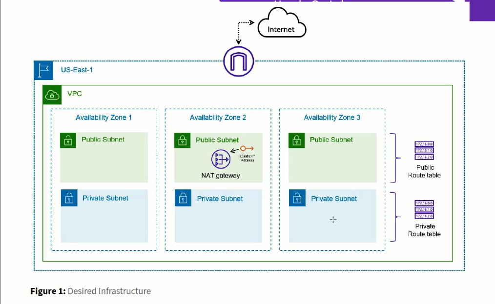
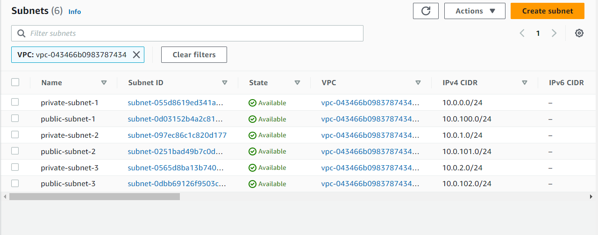
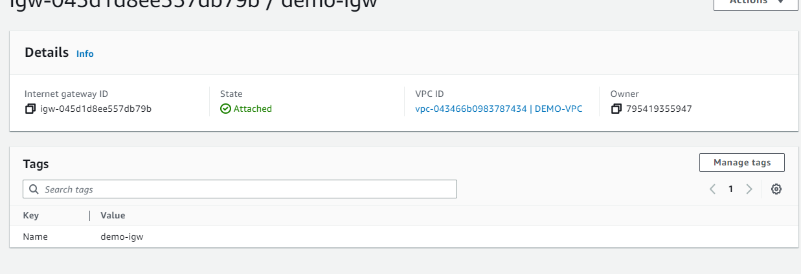
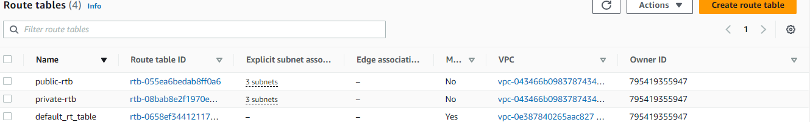
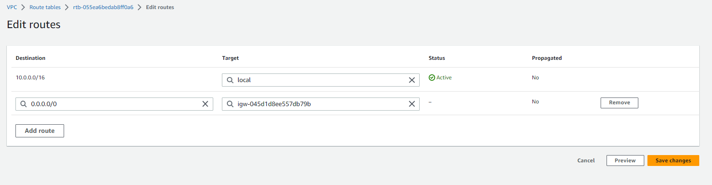
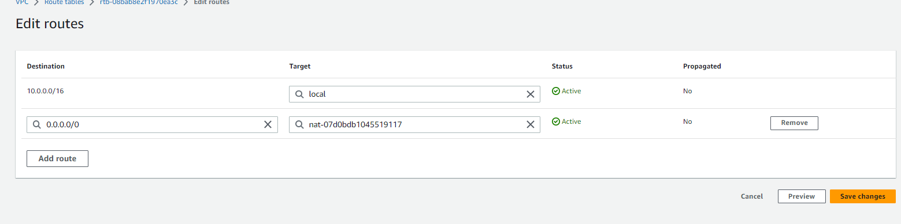

# Terraform/IAC Udemy notes

## Manual set up VPC
## STEPS in order (TASKS) :
1) Create VPC

2) Create Subnets 

- create multiple private and public subnets across 3 AZ
- 1 public/1 private subnet per AZ
1) Create IGW 
- attach IGW to VPC

1) Create NAT gateway

1) Create public and private route tables:

- associate private and public subnets to our route tables

- route public rtb to IGW - to go out to internet

- route private rtb to NAT gateway, to access outside internet

---

# Clear point
- Terraform state file compares current infrastructure, and applys any changes to match
what is defined in that state file
